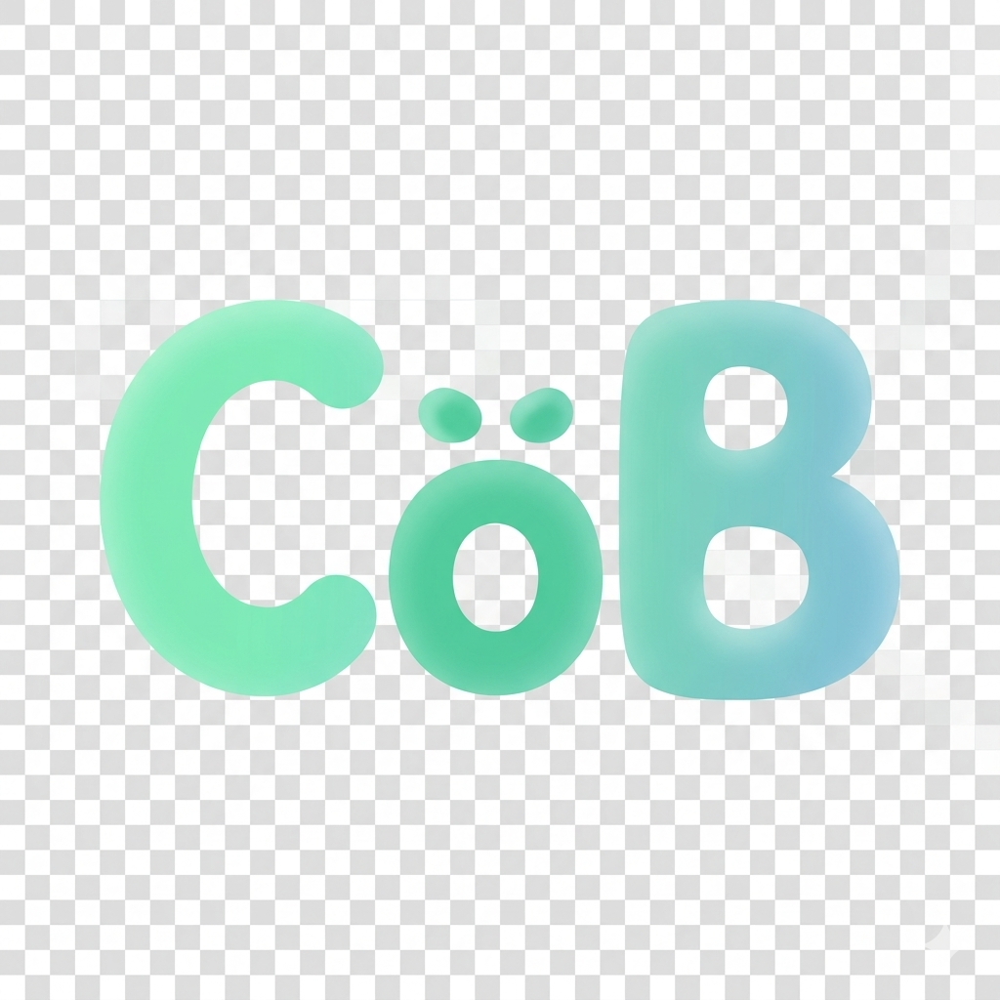

<p align="center">
  
</p>

<h1 align="center">CoBeing</h1>

<p align="center">
  <strong>Native Multi-Agent Collaboration Framework</strong>
</p>

<p align="center">
  <a href="README_CN.md">中文</a>
</p>

<p align="center">
  
</p>

---

## Core Features

### Native Multi-Agent Architecture

CoBeing is not a wrapper around a single AI, but a **multi-agent collaboration system designed from scratch**. Each Agent is an independent entity with its own memory, experience, and personality.

This architecture enables **specialized division of labor** — each Agent focuses on one domain, more professional than a "jack-of-all-trades AI". Multiple Agents can **work in parallel**, multiplying efficiency. Agents are **reusable** across different projects and groups. When new capabilities are needed, just create a new Agent without affecting existing systems.

### Butler Agent & Host Agent

The **Butler** is the user's first point of contact, like an experienced project manager. It understands user needs, determines what kind of Agents are needed, automatically creates and configures them, organizes groups and assigns roles.

The **Host** is the group's moderator and coordinator, like a meeting facilitator. It guides discussion direction to prevent going off-topic, assigns tasks to ensure every Agent has work to do, and drives decisions to prevent endless discussions.

Users just tell the Butler "what I want to do", and the Butler handles everything. The Host ensures discussions stay on track, tasks get done, and decisions get implemented. The Butler is responsible for "finding the right people", the Host is responsible for "doing the right things".

### Native Inter-Agent Communication

In traditional approaches, Agent communication requires human relay, which is slow and error-prone. CoBeing's Agents can **communicate directly** with each other without human mediation.

Supports **group discussions** — multiple Agents collaborate in the same group, like a real team discussing. Supports **directed messages** — Agents can @mention other Agents for direct point-to-point communication. Supports **task relay** — when an Agent finds a task beyond its capability, it can hand off to a more suitable Agent.

Agents communicate directly without human translation. Communication is structured, no information loss. Supports one-to-many, many-to-many, relay, and other communication patterns.

### TODOboard

When multiple Agents collaborate, tasks easily get forgotten, progress is hard to track, and responsibilities are unclear. CoBeing has a built-in **task management system** to make group collaboration traceable.

The Host can create, assign, and track tasks. TODOs can set due times and automatically remind relevant Agents. Complete lifecycle management from pending to completed. Each TODO has a clear owner.

All tasks are recorded, nothing gets forgotten. Progress at a glance, know how much is completed. Each task has an owner, avoiding buck-passing.

### Self-Learning

AI starts from scratch every conversation, not learning from past work. CoBeing's Agents have **self-evolution capabilities**, learning from work experience.

Through **EXPERIENCE.md** to record accumulated work experience, through **MEMORY.md** to store important events and decisions. Agents can proactively review and summarize experience, discover their own shortcomings and improve.

Agents learn from past mistakes and won't repeat them. Experience doesn't disappear when conversation ends, it keeps accumulating. Agents can proactively identify their own shortcomings and improve, getting better with use.

---

## Project Structure

```
CoBeing/
├── packages/
│   ├── shared/          # Shared types and utilities
│   ├── providers/       # LLM Provider implementations
│   ├── channels/        # Channel adapters
│   └── core/            # Core logic
├── gui-v2/              # Tauri desktop application
├── config/              # Configuration files
├── skills/              # Built-in skills
├── prompts/             # Prompt templates
├── sandbox/             # Docker sandbox configuration
└── scripts/             # Development scripts
```

---

## Core Concepts

### Agent

Agent is the core unit of CoBeing. Each Agent has independent:
- **SOUL.md**: Personality traits and behavioral principles
- **CHARACTER.md**: Character description and background
- **JOB.md**: Focus areas and work methods
- **MEMORY.md**: Memory storage
- **EXPERIENCE.md**: Experience accumulation

### Group

Group is a container for multi-Agent collaboration, supporting:
- Multiple collaboration protocols (discussion, division of labor, relay, etc.)
- Task assignment and progress tracking
- Decision recording and knowledge sharing

### Skill

Skill is a reusable workflow methodology, stored in the `skills/` directory:
- Each skill is a directory containing `SKILL.md`
- Supports frontmatter metadata
- Can be dynamically loaded and executed by Agents

### Channel

Channel is the interface for user interaction:
- Currently supports QQBot (via OneBot v11 protocol)
- More channels under development (Discord, WeCom, Feishu, etc.)

By connecting QQBot, you can **communicate with Agent groups directly on mobile QQ**, enabling collaboration anytime, anywhere.

---

## Changelog

### v1.1.1 (2026-04-27)

**Bug Fixes:**
- Fix group message persistence — Agent replies now sync to GroupContextV2, current.md, and context.jsonl
- Fix ContextWindow tool_calls validation — changed from global pre-collection to forward scanning, resolves message corruption in multi-round tool calls
- Fix tool execution exception breaking conversation chain — catch exceptions and write isError message to prevent tool_calls chain crash
- Fix current.md parsing compatibility — support both JSON-wrapped and JSONL formats
- Fix Provider hot-reload not reading file — API Key changes now take effect immediately after frontend save

**Improvements:**
- Remove tool call round limit — maxToolRounds set to unlimited
- CurrentMd now uses in-memory operations — reduces disk I/O, avoids concurrent file write conflicts
- GroupContextV2 adds appendSilent — write messages without triggering callbacks, prevents duplicate wake-ups

---

## Quick Start

### Option 1: Use Release Archive (Recommended)

1. Go to [Releases](https://github.com/CH3SH-LC/CoBeing/releases) and download the latest archive
2. Extract to any directory
3. Double-click `start.bat` to launch

> **Note:** Running the terminal in the background may trigger antivirus false positives. If blocked, add the CoBeing directory to your antivirus whitelist.

### Option 2: Build from Source

**Requirements:**
- Node.js >= 22
- pnpm >= 10
- Docker (optional, for sandbox features)

**Installation:**

```bash
# Clone repository
git clone https://github.com/CH3SH-LC/CoBeing.git
cd CoBeing

# Install dependencies
pnpm install

# Configure environment variables
cp .env.example .env
# Edit .env file and add your API keys

# Build project
pnpm build

# Start development server
pnpm dev
```

---

## Supported LLM Providers

> **Recommendation:** We suggest using **DeepSeek V4** for the best balance of performance and cost.

| Provider | Models | Status |
|----------|--------|--------|
| DeepSeek | V4 Flash, V4 Pro | ✅ |
| OpenAI | GPT-5.4, GPT-4.1, O4 Mini | ✅ |
| Anthropic | Claude Opus 4.7, Sonnet 4.6, Haiku 4.5 | ✅ |
| Google | Gemini 3.1 Pro, Gemini 3 Flash | ✅ |
| Zhipu | GLM-5.1, GLM-4V Plus, CodeGeeX 4 | ✅ |
| Qwen | Qwen 3.6, QwQ 32B, Qwen Max | ✅ |
| MiniMax | MiniMax 2.7, MiniMax M1 | ✅ |
| Volcengine | Seed 2.0, Doubao Pro | ✅ |
| Grok | Grok 3, Grok 3 Mini | ✅ |
| Moonshot | Kimi 2.6, Moonshot V1 | ✅ |
| SiliconFlow | DeepSeek V3/R1, Qwen3, GLM-4 | ✅ |

---

## Development

### Build

```bash
# Build all packages
pnpm build

# Build single package
pnpm --filter @cobeing/core build

# Watch mode
pnpm dev
```

### Test

```bash
# Run all tests
pnpm test

# Run single package tests
pnpm --filter @cobeing/core test

# Watch mode
pnpm test:watch
```

---

## Acknowledgements

### Project Inspiration

- [OpenClaw](https://github.com/openclaw) - Open source AI Agent framework
- [Hermes](https://github.com/hermes-agent) - Terminal Agent framework
- [Claude Code](https://claude.ai/code) - AI programming assistant

### Model Support

- [Zhipu Qingyan](https://open.bigmodel.cn/) - GLM series models
- [Xiaomi MIMO](https://mimo.xiaomi.com/) - MIMO series models

### Individual Contributions

- **Liu Cheng** - Developer
- **Fan Hongjiao, Ma Zhuqi, Cui Xitong** - Project testing and feedback

### Institutional Support

- **Shanghai Jiao Tong University, School of Artificial Intelligence, Geek Center** - Token support

### Special Thanks

- **Brother Dawei** - Project inspiration

---

## License

This project is licensed under the MIT License - see [LICENSE](LICENSE) file for details

---

## Contact

- Issue Reports: [GitHub Issues](https://github.com/CH3SH-LC/CoBeing/issues)
- Discussions: [GitHub Discussions](https://github.com/CH3SH-LC/CoBeing/discussions)

---

**CoBeing** - Let multiple AIs work together for you 🚀
