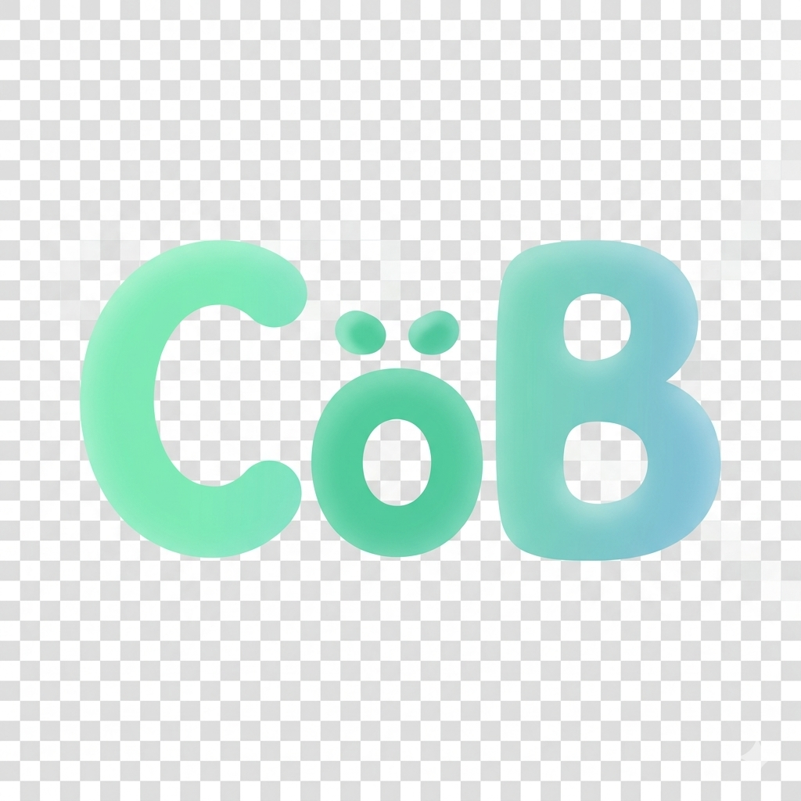

<p align="center">
  
</p>

<h1 align="center">CoBeing</h1>

<p align="center">
  <strong>原生多智能体协作框架</strong>
</p>

<p align="center">
  <a href="README.md">English</a>
</p>

<p align="center">
  
</p>

---

## 核心特性

### 原生多智能体架构

CoBeing 不是在单个 AI 上套壳，而是**从零设计的多智能体协作系统**。每个 Agent 都是独立的个体，拥有自己的记忆、经验和人格。

这种架构让**专业分工**成为可能——每个 Agent 专注一个领域，比"全能 AI"更专业。多个 Agent 可以**并行工作**，效率倍增。而且 Agent 是**可复用**的，同一个 Agent 可以在不同项目、不同群组中发挥作用。当需要新能力时，只需创建新 Agent，不影响现有系统。

### 管家智能体与群主智能体

**管家（Butler）** 是用户的第一接触点，像一个经验丰富的项目经理。它理解用户需求，判断需要什么样的 Agent，自动创建和配置，组织群组并分配角色。

**群主（Host）** 是群组的主持人和协调者，像一个会议主持人。它引导讨论方向避免跑题，分配任务确保每个 Agent 都有事做，推动决策避免无休止的讨论。

用户只需要告诉管家"我要做什么"，管家会搞定一切。群主确保讨论不跑题、任务有人做、决策能落地。管家负责"找对人"，群主负责"做对事"。

### 原生智能体间通讯

传统方案中，Agent 之间的通讯需要经过人类中转，效率低、容易失真。CoBeing 的 Agent 可以**直接对话**，不需要人类中转。

支持**群组讨论**——多 Agent 在同一群组中协作，像真实团队一样讨论。支持**定向消息**——Agent 可以 @mention 其他 Agent，直接点对点沟通。支持**任务接力**——Agent 发现任务超出自己能力时，可以转交给更合适的 Agent。

Agent 直接对话，不需要人类翻译。沟通是结构化的，不会丢失信息。支持一对多、多对多、接力等多种通讯模式。

### TODOboard

多 Agent 协作时，任务容易遗漏、进度难以跟踪、责任不清晰。CoBeing 内置**任务管理系统**，让群组协作有迹可循。

群主可以创建、分配、跟踪任务。TODO 可以设置到期时间，自动提醒相关 Agent。从 pending 到 completed 的完整生命周期管理。每个 TODO 都有明确的负责人。

所有任务都有记录，不会遗忘。进度一目了然，知道完成了多少。每个任务都有负责人，避免推诿。

### 自主学习

AI 每次对话都是从零开始，不会从过去的工作中学习。CoBeing 的 Agent 具备**自我进化能力**，会从工作中积累经验。

通过 **EXPERIENCE.md** 记录工作中积累的经验，通过 **MEMORY.md** 存储重要的事件和决策。Agent 可以主动回顾和总结经验，发现自己的不足并改进。

Agent 会从过去的错误中学习，不再重复犯错。经验不会随对话结束而消失，会一直积累。Agent 可以主动发现自己的不足并改进，越用越好。

---

## 快速开始

### 方式一：使用 Release 压缩包（推荐）

1. 前往 [Releases](https://github.com/CH3SH-LC/CoBeing/releases) 下载最新压缩包
2. 解压到任意目录
3. 双击 `start.bat` 启动

> **注意：** 后台运行终端可能导致杀毒软件误判。如果遇到拦截，请将 CoBeing 目录添加到杀毒软件的白名单中。

### 方式二：从源码构建

**环境要求：**
- Node.js >= 22
- pnpm >= 10
- Docker（可选，用于沙箱功能）

**安装步骤：**

```bash
# 克隆仓库
git clone https://github.com/CH3SH-LC/CoBeing.git
cd CoBeing

# 安装依赖
pnpm install

# 配置环境变量
cp .env.example .env
# 编辑 .env 文件，填入你的 API Key

# 构建项目
pnpm build

# 启动开发服务器
pnpm dev
```

### 配置

编辑 `config/default.json` 文件：

```json
{
  "core": {
    "logLevel": "info",
    "dataDir": "./data",
    "skillsDir": "./skills"
  },
  "providers": {
    "deepseek": {
      "apiKeyEnv": "DEEPSEEK_API_KEY",
      "baseURL": "https://api.deepseek.com"
    }
  }
}
```

---

## 项目结构

```
CoBeing/
├── packages/
│   ├── shared/          # 共享类型和工具
│   ├── providers/       # LLM Provider 实现
│   ├── channels/        # QQBot Channel 适配器
│   └── core/            # 核心逻辑
├── gui-v2/              # Tauri 桌面应用
├── config/              # 配置文件
├── skills/              # 内置技能
├── prompts/             # Prompt 模板
├── sandbox/             # Docker 沙箱配置
└── scripts/             # 开发脚本
```

---

## 核心概念

### Agent

Agent 是 CoBeing 的核心单元，每个 Agent 有独立的：
- **SOUL.md**：性格特质和行为准则
- **CHARACTER.md**：人物描写和背景
- **JOB.md**：专注领域和工作方式
- **MEMORY.md**：记忆存储（SQLite FTS5 全文搜索）
- **EXPERIENCE.md**：经验积累
- **TOOLS.md**：工具使用策略
- 每个 Agent 可独立配置 LLM Provider 和 Model
- 外部工作区绑定（`bind` 到任意项目目录）
- 4 级权限系统（full-access / workspace-write / read-only / ask）

### Group

Group 是多 Agent 协作的核心单元，更像"项目工作组"而非"聊天群"：
- **生命周期管理** — active → completed（自动检测 TODO 全完成 + 静默 >1h）→ archived（zip 打包归档）
- **任务分解** — 群主分解任务，支持父子层级和依赖链（dependsOn）
- **投票与共识** — vote-create / cast / result，过半通过，平局群主仲裁
- **经验沉淀** — group-experience-add / summarize，跨 Agent 知识共享
- **群组工作区** — 共享 TASK.md / PLAN.md / PROGRESS.md / MEMBERS.md / STRUCTURE.md
- **Screener** — 可选双模型初筛，轻量 LLM 判断是否唤醒主模型

### Skill

Skill 是可复用的工作流方法论，存储在 `skills/` 目录：
- 每个技能是一个目录，包含 `SKILL.md`
- 支持 frontmatter 元数据
- 可以被 Agent 动态加载和执行
- **元技能体系** — cognitive-toolkit / collaboration-mindset / learning-loop
- Agent 级技能白名单（config.json skills 字段）

### Channel

Channel 是与用户交互的渠道：
- QQBot（QQ 官方 Bot API v2）

接入 QQBot 后，可以在 QQ 上与 Agent 群组对话。

---

## 更新日志

### v1.2.0（2026-05-13）

**新功能：**
- Master Registry — 统一 Agent/Group 注册表（`data/registry.json`），单一真相源
- 群组生命周期管理 — active → completed → archived 状态机，自动完成检测
- 群组工作区 — Agent 在群组中文件工具自动指向群组工作区目录
- 投票与共识机制 — vote-create/cast/result，过半通过，群主仲裁
- 任务依赖管理 — 父子任务层级，dependsOn 依赖链，上游完成自动触发下游
- Agent 外部工作区绑定 — `bind` 到任意外部项目目录
- 可观测性仪表盘 — LLM 调用、工具调用、Token 统计、延迟指标，自动刷新
- Provider 自动降级 — timeout/503/500/402/429 等错误自动切换备选 Provider
- 主题系统重设计 — 6 个视觉鲜明主题（3 浅色：樱花薄荷/晨曦琥珀/薰衣草雨；3 深色：墨夜翡翠/子夜紫晶/熔岩暗金）
- 全部 UI 颜色迁移至 CSS 变量 — 主题感知颜色系统，零硬编码
- TODO 看板视图 — 4 列分组 + 批量完成/删除/重新分配
- 元技能体系 — cognitive-toolkit / collaboration-mindset / learning-loop
- 消息状态反馈 — sending → sent → streaming → done/error 完整生命周期
- 渠道消息发送者署名 — 外部渠道消息正确显示发送者名称

**改进：**
- WakeSystem 重设计为 fire-and-forget 独立定时器模式，各群组并发不阻塞
- Agent/群组列表按最近发言时间排序
- 侧边栏切换视图时自动选择首个项目
- Agent 对话中工具调用合并为可折叠组
- 群组聊天界面与 Agent 聊天对齐（居中输入框、动画思考指示器）
- 逾期 TODO 检测与优先排序
- 协作意识：Agent 感知队友能力、活跃状态
- 主动协作：Agent 可通过 group-send / group-update-progress 工具主动沟通
- 知识共享：group-experience-add / group-experience-summarize 沉淀协作经验

**修复：**
- 幽灵群组彻底解决（内容级验证 + delete fallback 重命名）
- 全链路对话持久化修复（14 项：保存时机、竞态、发送者署名等）
- 群组成员变更不持久化 → 重启丢失成员
- PermissionEnforcer 路径解析不一致导致群组工具调用全部被拒绝
- Windows SQLite WAL 文件锁导致无法删除 Agent/群组
- 关闭顺序竞态导致对话数据丢失
- 僵尸进程 + 编译缓存导致启动版本不一致
- 工具调用轮次限制解除（原 20 轮 → 无限）

### v1.1.1（2026-04-27）

**Bug 修复：**
- 修复群组消息持久化闭环 — Agent 回复后同步写入 GroupContextV2、current.md、context.jsonl
- 修复 ContextWindow tool_calls 完整性检查 — 从全局预收集改为正向逐向扫描，解决多轮工具调用时消息错乱
- 修复工具执行异常导致对话链断裂 — 捕获异常并写入 isError 消息，防止 tool_calls 链崩溃
- 修复 current.md 解析兼容性 — 同时支持 JSON 包裹格式和 JSONL 格式
- 修复 Provider 热重载不读文件 — 前端保存 API Key 后立即生效

**改进：**
- 工具调用轮次限制解除 — maxToolRounds 改为无限制
- CurrentMd 改为内存操作 — 减少磁盘 I/O，避免并发写文件冲突
- GroupContextV2 新增 appendSilent — 写入消息不触发回调，避免重复唤醒

---

## 支持的语言模型

> **建议：** 推荐使用 **DeepSeek V4**，兼顾性能和成本。

| Provider | 模型 | 状态 |
|----------|------|------|
| DeepSeek | V4 Flash, V4 Pro | ✅ |
| 智谱 (GLM) | GLM-5.1, GLM-4.7, GLM-Z1, CodeGeeX 4 | ✅ |
| 通义千问 | Qwen-Max, Qwen-Plus, Qwen-Turbo, QwQ 32B | ✅ |
| MiniMax | MiniMax-M2.7, MiniMax-M2.5, abab6.5s | ✅ |
| 火山引擎 (豆包) | Seed 2.0, Doubao Pro, Doubao Lite | ✅ |
| Moonshot (Kimi) | Kimi K2.6, Kimi K2.5, Kimi K2 | ✅ |
| MiMo | MiMo V2.5 Pro, MiMo V2 Pro, MiMo V2 Flash | ✅ |

---

## 开发

### 构建

```bash
# 构建所有包
pnpm build

# 构建单个包
pnpm --filter @cobeing/core build

# 监听模式
pnpm dev
```

### 测试

```bash
# 运行所有测试
pnpm test

# 运行单个包的测试
pnpm --filter @cobeing/core test

# 监听模式
pnpm test:watch
```

---

## 致谢

### 项目灵感

- [OpenClaw](https://github.com/openclaw) - 开源 AI Agent 框架
- [Hermes](https://github.com/hermes-agent) - 终端 Agent 框架
- [Claude Code](https://claude.ai/code) - AI 编程助手

### 模型支持

- [智谱清言](https://open.bigmodel.cn/) - GLM 系列模型
- [小米 MIMO](https://mimo.xiaomi.com/) - MIMO 系列模型

### 个人贡献

- **刘诚** - 开发者
- **范红娇、马珠淇、崔熙童** - 项目测试与反馈

### 机构支持

- **上海交通大学人工智能学院极客中心** - 提供 token 支持

### 特别感谢

- **大伟哥** - 提供项目灵感

---

## 许可证

本项目基于 MIT 许可证发布 - 详见 [LICENSE](LICENSE) 文件

---

## 联系方式

- 问题反馈：[GitHub Issues](https://github.com/CH3SH-LC/CoBeing/issues)
- 讨论交流：[GitHub Discussions](https://github.com/CH3SH-LC/CoBeing/discussions)

---

**CoBeing** - 让多个 AI 一起帮你干活 🚀

