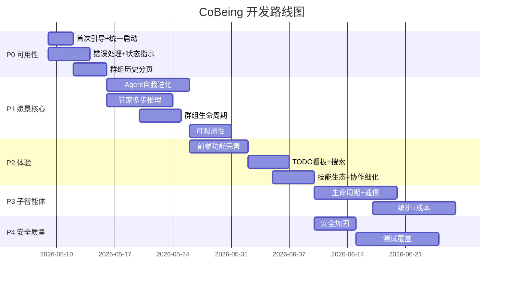

# CoBeing 完整待办

> 最后更新：2026-05-25 | 项目规模：~90 TS + ~55 TSX, 282 tests
> 愿景文档：`GOAL.md`

---

## 图例

- ✅ 已完成
- 🔄 进行中 / 部分完成
- 📋 待开始
- ❌ 已取消 / 决定不做

---

## P0 — 必须现在做（否则不可用）

### 0.1 首次启动体验

| 优先级 | 事项 | 说明 | 文件影响 |
|--------|------|------|----------|
| **P0** | ✅ **GUI 新手教程** | 首次启动自动检测，弹出交互式教程引导（非阻断式，可关闭）。已启动过的用户可在设置中重新打开 | `runtime.ts`, `gui-v2/SettingsView.tsx`, `gui-v2/TutorialOverlay.tsx` |
| **P0** | ✅ **统一启动入口** | 合并 `start.bat`(CLI) 和 `start-gui.bat`(GUI) 为一个入口，默认打开 GUI | `start.bat`, `start-gui.bat` |
| **P0** | ✅ **预编译安装包** | 提供可直接下载安装的 .exe/.msi，不依赖 Rust 工具链 | `build-gui.bat`, CI/CD |

### 0.2 错误处理与恢复

| 优先级 | 事项 | 说明 | 文件影响 |
|--------|------|------|----------|
| **P0** | ✅ **LLM 错误用户友好化** | 将技术错误（ETIMEDOUT、401 等）转为中文可操作提示 | `conversation-loop.ts` |
| **P0** | ✅ **WS 连接状态指示** | 前端顶部横幅显示连接状态（已连接/重连中/已断开） | `gui-v2/`, `useWebSocket.ts` |
| **P0** | ✅ **消息发送状态反馈** | 消息气泡显示"已发送→已接收→处理中→已完成"状态 | `gui-v2/chat.ts`, `ChatView.tsx` |
| **P0** | ✅ **Provider 自动降级** | 默认 Provider 不可用时自动尝试其他配置的 Provider | `runtime.ts`, `llm-gateway.ts` |

### 0.3 群组历史分页

| 优先级 | 事项 | 说明 | 文件影响 |
|--------|------|------|----------|
| **P0** | ✅ **前端群组历史分页加载** | GroupChatView 实现无限滚动，按时间分页请求 | `gui-v2/GroupChatView.tsx`, `ws-server.ts` |
| **P0** | ✅ **后端历史查询 API** | WS 命令支持 `since`/`limit`/`before` 参数 | `ws-server.ts`, `group-db.ts` |

---

## P1 — 愿景核心缺口

### 1.1 Agent 自我进化闭环 ✅ 已完成

| 事项 | 说明 | 难度 | 文件影响 |
|------|------|------|----------|
| ✅ **对话驱动性格调整** | experience-reflect 新增 `soul_update` 参数 → 追加 SOUL.md"自我进化"段 | 中 | `experience-reflect.ts`, `agent.ts` |
| ✅ **自动工具策略生成** | experience-reflect 新增 `tool_usage` 参数 → 追加 TOOLS.md"策略"段 | 中 | `experience-reflect.ts` |
| ✅ **经验反思增强** | experience-reflect 新增 `lesson` 参数 → 追加 EXPERIENCE.md"教训"段 | 低 | `experience-reflect.ts` |
| ✅ **BOOTSTRAP 持久注入** | 现有行为已正确（不删除，每次激发），无需改动 | 低 | 无需 |
| ✅ **BOOTSTRAP 动态注入 Skill 列表** | prompt-builder 从 config.json 自动读取 skills 并追加到 prompt | 低 | `prompt-builder.ts` |

### 1.2 管家多步推理 ✅ 已完成

| 事项 | 说明 | 难度 | 文件影响 |
|------|------|------|----------|
| ✅ **butler-analyze-task 增强** | System prompt 驱动多步推理：自主查Registry→判断→创建→组队 | 中 | `butler.ts`, `runtime.ts` |
| ✅ **管家主动建议** | System prompt 加入主动建议准则，完成复杂任务后评估角色缺口 | 中 | `runtime.ts` |
| ✅ **群组进展跟踪** | 新增 butler-check-group 工具，读取 PROGRESS.md + TODO 状态 | 中 | `butler.ts` |
| ✅ **Agent 负载感知** | butler-list 输出增强，显示中文状态标签（空闲/忙碌中/异常） | 低 | `butler.ts` |

### 1.3 群组生命周期管理 ✅ 已完成

| 事项 | 说明 | 难度 | 文件影响 |
|------|------|------|----------|
| ✅ **群组状态机** | active → completed → archived，冻结规则：completed 拒写/archived 全冻 | 中 | `group.ts`, `manager.ts` |
| ✅ **完成检测** | Scanner 60s 扫描，TODO 全完成 + 静默>1h → 自动标记 completed | 中 | `group-scanner.ts`, `manager.ts` |
| ✅ **归档/恢复** | 硬归档：zip 打包到 data/archives/，恢复解压重建 Group + Scanner | 中 | `manager.ts` |
| ✅ **工作区文档自动同步** | TODO 完成 → 自动追加 PROGRESS.md；群组完成 → 追加总结行 | 低 | `group-scanner.ts`, `workspace.ts` |

### 1.4 可观测性 ✅ 已完成

| 事项 | 说明 | 难度 | 文件影响 |
|------|------|------|----------|
| ✅ **LLM 调用日志** | 记录每次 LLM 调用的 model、耗时、Token、错误 | 中 | `observability-db.ts`, `conversation-loop.ts` |
| ✅ **工具调用审计** | 记录每个 Agent 调用了哪些工具、耗时、成功/失败 | 低 | `observability-db.ts`, `executor.ts` |
| ✅ **Token 消耗按群组聚合** | 前端仪表盘显示每个群组/Agent 的累计 Token | 低 | `observability store`, `ws-server.ts`, `DashboardView.tsx` |
| ✅ **Agent 响应时间监控** | 统计 P50/P95 响应时间、24h 趋势图 | 中 | `observability-db.ts`, `LatencyCard.tsx` |

---

## P2 — 体验提升

### 2.1 前端功能完善

| 事项 | 说明 | 难度 | 文件影响 |
|------|------|------|----------|
| ✅ **对话全文搜索** | 接入 SQLite FTS5 搜索历史对话 | 中 | `gui-v2/ChatSearch.tsx`, `ws-server.ts` |
| ✅ **Agent 状态时间线** | 可视化显示 Agent 的活动历史（开始处理→工具调用→完成） | 中 | `gui-v2/`, `activity.ts store` |
| ✅ **数据导出** | 一键导出 data/ 目录或按群组/Agent 导出为 JSON/MD | 低 | `ws-server.ts`, `gui-v2/` |
| ✅ **侧边栏自动刷新** | Agent/Group 创建/删除后无需手动刷新 | 低 | `useWebSocket.ts`, `stores/` |
| 📋 **MCP 状态监控** | 前端显示 MCP 服务器连接状态、工具列表 | 低 | `McpSection.tsx` |

### 2.2 TODO 与任务管理

| 事项 | 说明 | 难度 | 文件影响 |
|------|------|------|----------|
| ✅ **TODO 看板视图** | 将 TODO 列表展示为看板（待处理→进行中→审核→完成） | 中 | `gui-v2/TodoPanel.tsx` |
| ✅ **TODO 批量操作** | 批量完成、删除、重新分配 | 低 | `todo/tools.ts`, `ws-server.ts` |
| ✅ **TODO 到期提醒** | 前端通知 TODO 快到截止时间 | 低 | `gui-v2/`, `todo/scanner.ts` |
| ✅ **搜索结果智能截断** | 记忆搜索以匹配位置为中心截断，而非返回全文 | 低 | `memory-store.ts`, `sqlite-adapter.ts` |

### 2.3 技能生态

| 事项 | 说明 | 难度 | 文件影响 |
|------|------|------|----------|
| ✅ **元技能体系** | 替代原 4 个具体技能，改为 cognitive-toolkit / collaboration-mindset / learning-loop 三个通用元技能 | 低 | `skills/meta-skills/` |
| 📋 ~~测试生成技能~~ | 已被元技能体系取代 | — | — |
| 📋 ~~文档编写技能~~ | 已被元技能体系取代 | — | — |
| 📋 ~~代码重构技能~~ | 已被元技能体系取代 | — | — |
| 📋 ~~API 设计技能~~ | 已被元技能体系取代 | — | — |

### 2.4 群组协作细化

| 事项 | 说明 | 难度 | 文件影响 |
|------|------|------|----------|
| ✅ **Talk 子讨论结果回流可视化** | Talk 的结论自动摘要后发回 main 频道，前端展示"来自讨论"标签 | 中 | `group-tools.ts`, `gui-v2/` |
| ✅ **Screener 过滤统计** | 显示 Screener 拦截了多少条消息，节省了多少 Token | 低 | `screener.ts`, `gui-v2/` |
| ✅ **群组健康度面板** | 成员参与度、任务完成率、阻塞时间 | 中 | `gui-v2/`, `group.ts` |

---

## P3 — 子智能体优化（P4 原内容）

### 3.1 生命周期管理 ⚠️ 当前仅基础 spawn/cleanup

| 事项 | 说明 | 难度 |
|------|------|------|
| 📋 **并行 spawn** | 同时创建多个子智能体并行执行独立任务 | 中 |
| 📋 **超时控制** | 每个子智能体独立超时，超时后自动终止 | 低 |
| 📋 **资源配额** | 限制同时活跃的子智能体数量上限 | 中 |
| 📋 **重试机制** | 子智能体失败后自动重试（可配置次数） | 中 |
| 📋 **生命周期钩子** | onSpawn / onComplete / onError / onTimeout 回调 | 中 |

### 3.2 通信与上下文 ⚠️ 当前完全隔离

| 事项 | 说明 | 难度 |
|------|------|------|
| 📋 **上下文继承** | 子智能体可选择继承父 Agent 的对话历史摘要 | 中 |
| 📋 **结果回流** | 子智能体完成后结构化返回结果，父 Agent 直接引用 | 中 |
| 📋 **兄弟通信** | 同一父 Agent 下的子智能体之间传递中间结果 | 高 |
| 📋 **进度上报** | 子智能体执行中定期报告进度和当前步骤 | 中 |

### 3.3 编排能力 ⚠️ 当前无编排能力

| 事项 | 说明 | 难度 |
|------|------|------|
| 📋 **DAG 任务编排** | 父 Agent 定义任务依赖图，自动按拓扑顺序调度 | 高 |
| 📋 **结果聚合** | 多个子智能体输出自动合并 | 高 |
| 📋 **条件分支** | 根据前一个子智能体输出决定后续 spawn 哪个 | 高 |
| 📋 **流式管道** | 子智能体 A 的输出实时流入子智能体 B | 高 |

### 3.4 成本与追踪 ⚠️ 当前无成本追踪

| 事项 | 说明 | 难度 |
|------|------|------|
| 📋 **Token 消耗统计** | 每个子智能体独立记录 Token 用量 | 低 |
| 📋 **执行日志** | 子智能体执行过程可追溯（输入、工具调用、输出） | 中 |
| 📋 **成本预警** | 子智能体累计 Token 超过阈值时通知 | 低 |
| 📋 **性能基线** | 记录同类任务耗时和 Token 消耗 | 中 |

---

## P4 — 安全与质量

### 4.1 安全加固

| 事项 | 说明 | 难度 | 文件影响 |
|------|------|------|----------|
| 📋 **seccomp/apparmor profile** | Docker 容器安全配置文件 | 中 | `security.ts`, `Dockerfile` |
| 📋 **沙箱状态监控** | 运行中容器列表、资源占用实时展示 | 中 | `sandbox-monitor.ts`, `gui-v2/` |
| 📋 **网络策略 iptables 集成测试** | 验证 whitelist 模式实际限制网络访问 | 低 | `network-whitelist.test.ts` |
| 📋 **API Key 轮换支持** | 支持定期更换加密密钥 | 低 | `secret-store.ts` |

### 4.2 测试覆盖

| 事项 | 说明 | 难度 | 当前状态 |
|------|------|------|----------|
| 📋 **前端测试** | 47 个 TSX 文件零测试覆盖，至少覆盖 stores 和 hooks | 中 | ❌ 0% |
| 📋 **端到端协作集成测试** | 完整流程：创建群组→分解任务→Agent 协作→验收 | 高 | ❌ 无 |
| 📋 **多 Provider 集成测试** | Mock 测试所有 11 家 Provider 的 chat 接口 | 中 | ❌ 无 |
| 📋 **性能基准测试** | 10+ Agent、100+ 消息下的表现 | 高 | ❌ 无 |
| 📋 **安全渗透测试** | 尝试注入、路径穿越、越权访问 | 中 | ❌ 无 |
| 📋 **模糊测试** | 随机输入测试配置解析、消息处理 | 低 | ❌ 无 |

### 4.3 MCP 生态

| 事项 | 说明 | 难度 | 文件影响 |
|------|------|------|----------|
| 📋 **filesystem MCP 服务器** | 标准文件系统操作 MCP 服务器 | 低 | `mcp-servers/filesystem/` |
| 📋 **MCP 预设模板** | 前端 MCP 配置页预设常用服务器模板 | 低 | `gui-v2/McpSection.tsx` |

---

## 已完成工作汇总

### ✅ P0 已修复

- [x] WebSocket 绑定 127.0.0.1 — 防止局域网内未授权访问
- [x] get_config 不返回明文 API Key — 仅返回掩码值
- [x] setNestedValue 原型污染防护 — `__proto__`/`constructor`/`prototype` 守卫
- [x] host-decompose-task 依赖关系修复 — 改用回调参数
- [x] runtime.stop() 清理 — groupManager.disposeAll() + mcpManager.close() + 全局变量清除
- [x] Butler 缺少 injectGroupTools() — 补全 group-send 等工具
- [x] Docker 沙箱网络白名单 — iptables 规则实际执行
- [x] dockerCmd 改为 spawn — 防止命令注入

### ✅ P1 已修复

- [x] LLM Gateway 流式迭代超时 — 每 chunk 超时检测
- [x] SecretStore 密钥派生加固 — 持久化随机盐
- [x] ContainerPool 并发构建锁 — Map 支持多镜像
- [x] MemoryStore 初始化等待 — run() 前 await ready()
- [x] update_agent 重建 ConversationLoop — 配置变更即时生效
- [x] 投票截止检查 — load() 时自动标记过期投票
- [x] butler 缺少 todo-review 群组支持
- [x] 前端 ws-client 离线队列上限 100 条
- [x] 前端 chat store 单会话上限 500 条

### ✅ P1.4 可观测性（2026-05-08）

- [x] LLM 调用日志 — ObservabilityDB + ConversationLoop 埋点
- [x] 工具调用审计 — ToolExecutor 埋点（工具名、耗时、成功/失败）
- [x] Token 消耗按群组聚合 — 前端仪表盘 Token 卡片 + 7 天趋势
- [x] Agent 响应时间监控 — P50/P95 延迟卡片 + 24h 折线图
- [x] 完整仪表盘页面 — 5 卡片（Token/延迟/错误/工具排行/Agent 活跃度）

### ✅ P1.1 Agent 自我进化（2026-05-08）

- [x] 对话驱动性格调整 — experience-reflect `soul_update` → SOUL.md
- [x] 自动工具策略生成 — experience-reflect `tool_usage` → TOOLS.md
- [x] 经验反思增强 — experience-reflect `lesson` → EXPERIENCE.md
- [x] BOOTSTRAP 持久注入 — 确认现有行为正确，无需改动
- [x] Skill 列表注入 — prompt-builder 从 config 自动读取追加

### ✅ P1.2 管家多步推理（2026-05-08）

- [x] 多步推理 — System Prompt 驱动，管家自主编排（查Registry→创建Agent→组建群组→启动）
- [x] 主动建议 — 完成复杂任务后评估角色缺口，自然建议补充
- [x] 群组进展跟踪 — 新增 butler-check-group 工具，读取 PROGRESS.md + TODO 状态
- [x] Agent 负载感知 — butler-list 增强，显示中文状态标签（空闲/忙碌中/异常）

### ✅ P1.3 群组生命周期管理（2026-05-08）

- [x] 状态机 — active→completed→archived，冻结规则：completed拒写/archived全冻
- [x] 完成检测 — Scanner 60s扫描，TODO全完成+静默>1h自动标记completed
- [x] 归档/恢复 — zip打包到data/archives/，恢复解压重建Group+Scanner
- [x] 文档自动同步 — TODO完成→自动追加PROGRESS.md
- [x] 前端状态标签 — 侧边栏群组显示"已完成"/"已归档"标签

### ✅ P2 已修复

- [x] 文件路径泄露 — write-file/edit-file 使用相对路径
- [x] 投票截止后台检查 — load() 时自动标记过期
- [x] group-experience-summarize 描述去掉误导性"群主专用"
- [x] WS 命令文档补全 — get_wake_queue / get_skill_doc
- [x] 前端 disconnect() 清理 onerror/onmessage
- [x] 前端 `__wsClient` 全局泄漏移除

### ✅ 已完成功能模块

| 模块 | 说明 |
|------|------|
| Agent 系统 | 生命周期、自治文件系统、Prompt 构建链、子智能体、事件总线 |
| 群组协作 | GroupContextV2、WakeSystem、Host Agent、工作空间、依赖管理、投票、经验沉淀、Screener |
| 工具系统 | bash/read-file/write-file/edit-file/glob/grep/web-fetch + 群组/TODO/投票/记忆/技能/MCP 工具 |
| TODO 驱动 | Agent 级/群组级 TODO、时间触发、依赖触发、交付物验收 |
| 记忆系统 | 4 目标分层、SQLite FTS5、冻结快照、安全扫描、原子写入、自动反思 |
| 技能系统 | SKILL.md 格式、SkillRepository、Agent 级白名单、4 内置技能 |
| LLM 网关 | 并发控制、RPM 限制、超时重试、每 chunk 超时、Provider 热重载 |
| 沙箱 | Docker 隔离、容器复用、多语言检测、网络白名单、安全加固 |
| MCP | 标准协议客户端、Stdio/HTTP 传输、动态工具发现注册、QQ Bot 对接 |
| 多渠道 | QQ(OneBot/QQBot)、Discord、企业微信、飞书 |
| 前端 | React 19 + Tauri 2.0、Agent/Group 管理、群组聊天、TODO 面板、主题系统、MCP 配置 |
| 测试 | 281 测试全通过（36 文件）、EPERM 修复 |

---

## 开发顺序建议

> 注：P1 和 P4 可并行开发，P2 和 P3 在 P1 核心能力完成后开始。
> 总预估：~12 周（3 个月）完成所有 P0-P4 项。
